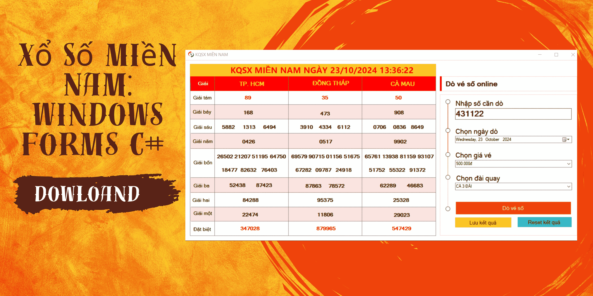

# Xổ Số Miền Nam

🌟 Khám Phá Ứng Dụng Xổ Số Miền Nam: Xây Dựng Ứng Dụng Windows Forms C# với Mã Nguồn Miễn Phí! 🌟

Chào mừng bạn đến với dự án "Xổ Số Miền Nam"! Đây là một ứng dụng Windows Forms được xây dựng bằng ngôn ngữ lập trình C# giúp bạn tham gia trải nghiệm xổ số miền Nam một cách thú vị và dễ dàng.

## Tính Năng Nổi Bật

- Quay số xổ số với các giải thưởng từ giải tám đến giải đặc biệt.
- Lưu trữ kết quả xổ số và so sánh với số đã quay.
- Hiển thị thông báo trúng thưởng và không trúng thưởng một cách trực quan.
- Giao diện người dùng thân thiện và dễ sử dụng.

## Hình Ảnh



## Hướng Dẫn Cài Đặt

1. Clone repository này về máy của bạn:
   ```bash
   git clone https://github.com/nguyenvanduydev001/xosomiennam.git
   ```
2. Mở dự án trong Visual Studio.
3. Chạy ứng dụng và thưởng thức!

**Video hướng dẫn:** [Youtube](https://youtu.be/zxb1RkjkMag)

---

*Đừng quên nhấn Đăng ký và Bật chuông để không bỏ lỡ bất kỳ video mới nào! Hãy bắt đầu hành trình lập trình của bạn ngay hôm nay!*